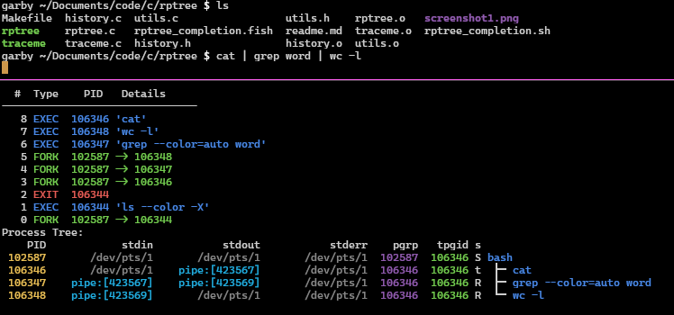

# rptree

A real-time process tree viewer and fork/exec/exit event monitor.

## Overview

**rptree** attaches to a process using the ptrace interface, and displays a live-updating view of the process tree originating on the chosen parent. It also displays a log of _events_: when processes call `fork()`, `exec()`, or `exit()`.



The above screenshot shows **rptree** with a bash instance as the parent. In this example, the user ran `ls` followed by `cat | grep word | wc -l`; only the latter is running at the time of the screenshot, whereas `ls` finished, as can be seen on line 6 of the history.

## Why?

It can be useful for debugging, especially for developing things like shells. The specific use case I made this for is the Operating Systems course at Chalmers University. I'm a teaching assistant in that course, and I think/hope that it will help with understanding the task to implement a shell.

It can also be pretty useful for just seeing what processes bash makes. Try watching `man gcc`, for example, and see how many processes are spawned. Or, how many processes would you expect to be created when bash simply runs `ls`?

## Usage

### Installation

**rptree** doesn't use any fancy dependencies. Simply clone or download the repo on a Linux system, run `make`, and you'll be left with an executable called `rptree`.

I've also provided an `rptree_completion.sh`, which you can source from your bash shell to provide command-line autocompletion of PIDs when invoking rptree. It's a bit nice to use.

For system installation, do this:

```sh
make
cp rptree /usr/bin
cp rptree_completion.sh /etc/bash_completion.d
```

You'll probably need to run those with `sudo`.

### Using **rptree**

Speaking of which, you probably also need to use `sudo` when running **rptree**, because otherwise you likely won't have permission to attach to other processes.

Simply run `rptree <the pid of your process>`, and everything should work. There's nothing else to it, because you can't interact with the program in any way (yet).

## Related Work

 - **(h)top** provides similar features to rptree, in that it can display a process tree in real time. It doesn't, however, provide a simple way to view and follow the tree of one specific process, as far as I can tell. It also doesn't show the log of events, which can be really useful for debugging.
 - **pstree** is quite similar, superficially, but with major differences. Aside from the fact that pstree also does not show a log of ptrace events, it also is not a real-time view, it just prints the tree and exits. You could do something like `watch pstree`, but you will then miss quickly exitting processes.
